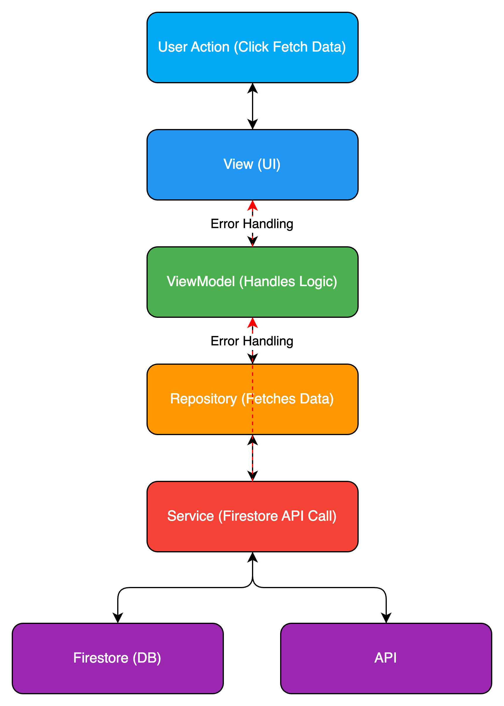

# value-list

## ディレクトリ構造

```
lib/
├── models/
│      └── user_model.dart
│   └── product_model.dart
├── view_models/
│   └── user_view_model.dart
│   └── product_view_model.dart
├── views/
│   ├── user_view.dart
│   ├── product_view.dart
│   └── widgets/
│       └── custom_button.dart
├── services/
│   └── auth_service.dart
│   └── api_service.dart
├── repositories/
│   └── user_repository.dart
│   └── product_repository.dart
├── utils/
│   └── constants.dart
│   └── helpers.dart
└── main.dart
```

## ディレクトリの詳細

### `models/`
モデル層。アプリケーションで使用するデータ構造を定義します。主にAPIからのデータやビジネスロジックに必要なデータをモデル化します。

- **例**: `user_model.dart`, `product_model.dart`

### `view_models/`
ビューモデル層。ビジネスロジックや状態管理を担います。モデルのデータを取得し、UIに渡すためのロジックを提供します。また、Providerパターンを使用して状態管理を行います。

- **例**: `user_view_model.dart`, `product_view_model.dart`

### `views/`
ビュー層。ユーザーインターフェースを構築し、`view_models`から提供されるデータに応じてUIを更新します。再利用可能なUIコンポーネントは`views/widgets/`に配置します。

- **例**: `user_view.dart`, `product_view.dart`, `widgets/custom_button.dart`

### `services/`
外部サービスやAPIとのやり取りを行う層です。認証やネットワーク通信、ローカルデータベースとのやり取りなど、ビジネスロジックに依存しない汎用的な機能を担当します。

- **例**: `auth_service.dart`, `api_service.dart`

### `repositories/`
データの取得元（API、ローカルDB、キャッシュなど）とビジネスロジックを分離するための層です。データ取得の抽象化を行い、`view_models`が依存するデータソースを統一的に扱います。

- **例**: `user_repository.dart`, `product_repository.dart`

### `utils/`
ユーティリティ層です。アプリ全体で使用する定数やヘルパー関数、カスタムロジックが含まれます。再利用性が高く、アプリケーション全体で共有される機能がここに配置されます。

- **例**: `constants.dart`, `helpers.dart`

### `main.dart`
アプリケーションのエントリーポイントです。`MaterialApp`や`Provider`の初期設定を行い、全体のルーティングや初期化処理を実施します。


